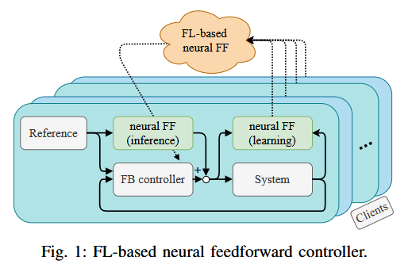
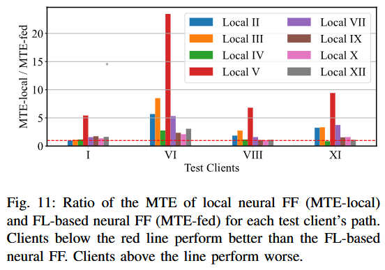
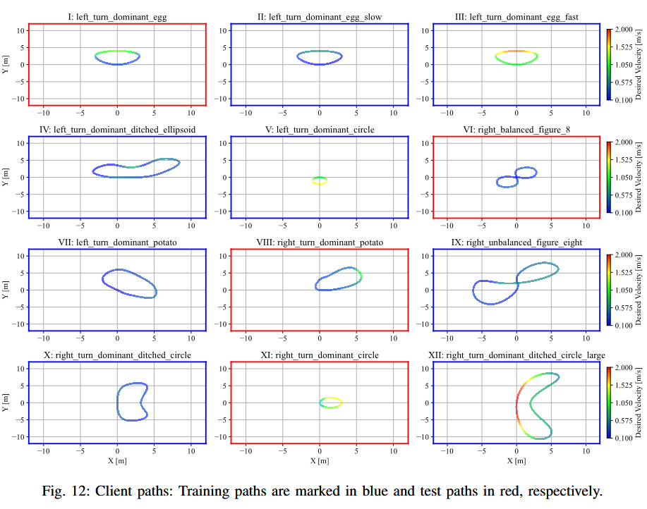
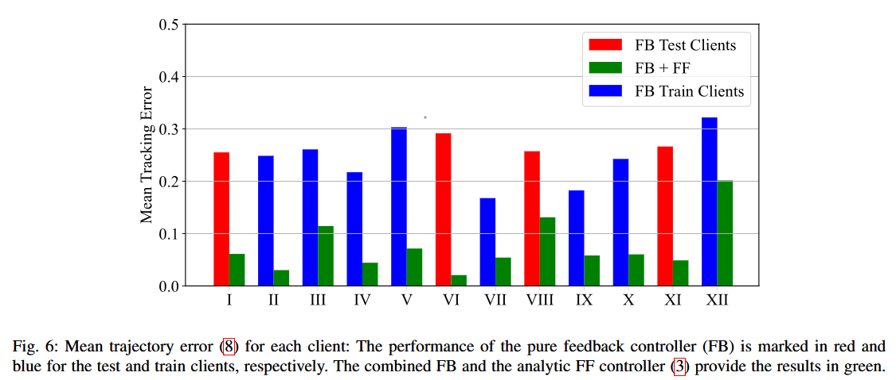

# Project Title

## Description
This repository contains code for experiments described in the paper *Federated Learning for Privacy-Preserving Feedforward Control in Multi-Agent Systems* ([arXiv:2503.02693](https://arxiv.org/abs/2503.02693)), submitted to the [IJCNN 2025](https://2025.ijcnn.org/).

The project includes implementations for centralized and federated learning in control applications, evaluation scripts, and utilities for processing and visualization. 

### Basics

The **FL-based neural feedforward (FF) control** integrates **Federated Learning (FL)** into FF control to enable **privacy-preserving, communication-efficient**, and **decentralized learning** of FF controllers in multi-agent systems. 
Instead of sharing raw data, **each agent (client) trains a local neural FF controller** using its private data and **only shares model updates** with a central server, where updates are aggregated using FL techniques like **FedAvg**.



The improved global model is then redistributed to clients for inference and further training.

Key benefits of this approach:
- **Preserves data privacy** by keeping raw data local.
- **Reduces communication costs** by transmitting only model updates instead of full datasets.
- **Enables decentralized, continuous learning** of FF controllers.
- **Improves tracking performance** in control applications, such as autonomous driving.

The method is validated through simulations in an **autonomous vehicle trajectory tracking** task. 
Results show that **FL-based neural FF control achieves comparable performance to centralized learning** while maintaining privacy and communication efficiency. 
It also outperforms purely local training by benefiting from shared model updates across multiple clients.

## Folder Structure
```
├── img/                      # Images and visualizations
│   ├── plots_centralized     # Centralized learning results
│   ├── plots_clients         # Client path visualization 
│   ├── plots_ctrl_performance # Control performance results
│   ├── plots_federated       # FL-based neural FF results
│   ├── plots_local           # Local models 
├── models/                   # Pre-trained models or model definitions
│   ├── local_models.pkl
│   ├── centralized_FFmodel.pth
│   ├── federated_FFmodel.pth
├── results/                  # Experimental results and logs
│   ├── clients               # Client-specific results
│   ├── FL_local_vs_global    # Local vs global FL results
├── config.json               # Configuration file for experiments
├── paths.json                # Client paths for federated learning
├── car_models.py             # Car dynamics
├── controller_models.py      # Controller models
├── exp_centralized_learning.py # Experiments 'centralized learning'
├── exp_client_paths.py        # Experiments for clients paths in federated learning
├── exp_FF_FB_performance_results.py # Results for pure feedforward & feedback control
├── exp_FL_base.py             # Results for FL-based neural FF control
├── exp_FL_eval_local_vs_global.py # Eval. local epochs vs. communication rounds
├── exp_local_models.py        # Experiments on local models
├── paths.py                   # Path generation for clients
├── utils_control.py           # Utility functions for control applications
├── utils_FL.py                # Utility functions for federated learning
├── env.yml                    # Python env configu 
```

## Getting Started
### Prerequisites
- Python 3.12
- Required Python packages (install via `requirements.txt` or `env.yml`)

### Installation
```bash
pip install -r requirements.txt  # If a requirements file is available
```
```bash
conda create -f env.yml  # If a conda environment file is available
```

## Usage
### Running Experiments
- **Centralized Learning:** 
    - Closed-loop simulation of training clients
    - Gather data at central server 
    - Training a centralized model for the FF control
    - Evaluate the performance on test clients
  ```bash
  python exp_centralized_learning.py
  ```
- **Federated Learning:**
    - **Proof of Concept:** *FL-based neural FF control*:
        - Closed-loop simulation for each training clients
        - Each client recievs the global model, trains locally, and sends the updated model to the server
        - Server aggregates the models
        - Evaluate the performance on test clients
        ```bash
        python exp_FL_base.py
        ```
        
    - **Local Epochs & Global Communication Rounds:**
        - Evaluate *FL-based neural FF controller* for different number of local epochs and global communication rounds
        ```bash
        python exp_FL_eval_local_vs_global.py
        ```
        
    - **Comparison to Local Neural FF**:
        - Train individual neural FF controller on each client
        - Comparison the the *FL-based neural FF controller*
        ```bash
        python exp_local_models.py
        ```
        
- **Client Paths:**
    - Generate client paths for federated learning
    - Visualize the paths
    ```bash
    python exp_client_paths.py
    ```
    
- **Control Performance:**
    - Evaluate the performance of the pure feedforward and feedback control
    ```bash
    python exp_FF_FB_performance_results.py
    ```
    
## Visualization
All plots in the paper are given in the `/img/` folder.

## Results 
Specifc client path information is stored in the `/results/clients/`.

The results of the experiment `exp_FL_eval_local_vs_global.py` are stored in the `/results/FL_local_vs_global/` folder. 
This experiment evaluates the number of local epochs vs. communication rounds for federated learning and takes some time to run. 
For efficient visualization, the results are stored in `.csv` files.

## Contribution
Feel free to submit issues or pull requests if you'd like to contribute to this project.

## License
This project is licensed under [CC BY-NC-ND 4.0](https://creativecommons.org/licenses/by-nc-nd/4.0/). 

